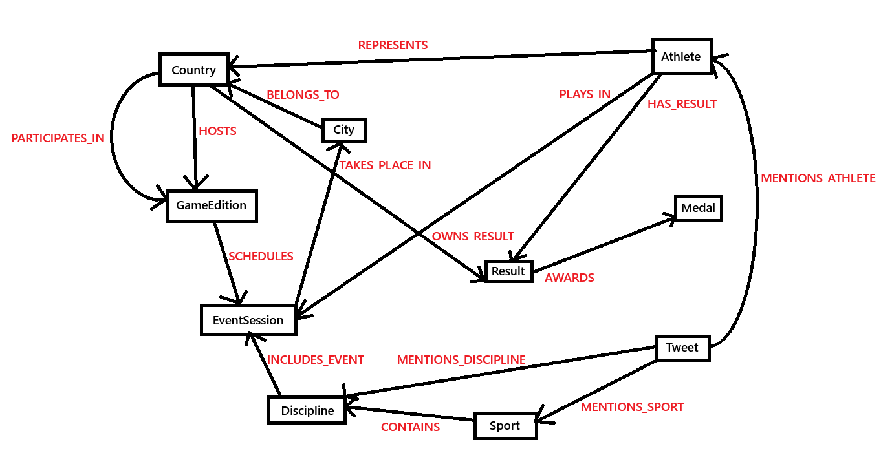

# Rapport d'expérimentation - Analyse des données des jeux olympiques

Le présent document a pour objectif de retranscrire l'ensemble des étapes utilisées, les données analysées et les scripts générés. Toutes ces informations ont pour objectif de garantir la reproductibilité des résultats et l'appréciation des recherches menées.

Ce document ainsi que les fichiers de données et les scripts sont disponible sur le dépôt : [GraphOlympics](https://github.com/CamilleAstrid/fr.utoulouse.GraphOlympics.git).

Le présent document a été converti au format pdf depuis un format md (markdown) à l'aide du site : https://www.pdfforge.org/online/fr/markdown-a-pdf

Les images ont été insérées pour la conversion au format pdf en base64 à l'aide du site : https://www.base64-image.de/


# Description des données

Le script `Extraction_header.sh` permet de récupérer les en-têtes des fichiers .CSV dans le dossier `data/`.

>[!NOTE]
>L'en-tête du fichier `Olympic_Athlete_Event_Results.csv` semble contenir un caractère spécial au niveau de la première colonne.   
>Nous verrons par la suite si cela entraînera des difficultés d'analyse.

L'attribut ***country_noc*** est le sigle associé au pays.
Exemple :
* Pour le pays *Bulgaria*, le country_noc est **BUL**
* Pour le pays *Switzerland*, le country_noc est **SUI**

>[!NOTE]
>Les données dans les fichiers contiennent des accents. Il faudra rendre les requêtes compatibles.

Contenu du fichier `headers.txt` :
```plain text
Olympic_Athlete_Bio.csv
athlete_id,name,sex,born,height,weight,country,country_noc,description,special_notes

Olympic_Athlete_Event_Results.csv
edition,edition_id,country_noc,sport,event,result_id,athlete,athlete_id,pos,medal,isTeamSport

Olympic_Games_Medal_Tally.csv
edition,edition_id,year,country,country_noc,gold,silver,bronze,total

Olympic_Results.csv
result_id,event_title,edition,edition_id,sport,sport_url,result_date,result_location,result_participants,result_format,result_detail,result_description

Olympics_Country.csv
noc,country

Olympics_Games.csv
edition,edition_id,edition_url,year,city,country_flag_url,country_noc,start_date,end_date,competition_date,isHeld

tokyo_2020_tweets.csv
id,user_name,user_location,user_description,user_created,user_followers,user_friends,user_favourites,user_verified,date,text,hashtags,source,retweets,favorites,is_retweet
```

La description des données qui seront téléversées dans Neo4J se trouve dans la dernière section : [Extrait des données utilisées](#extrait-des-données-utilisées).

# Modélisation

## Schéma entité-relation

### Entités (avec attributs clés)

* **COUNTRY**
    * *noc* (PK), country.

> Source : *Olympics_Country.csv*. 

* **GAMES_EDITION**
    * *edition_id* (PK)
    * edition
    * year
    * city
    * country_noc (FK→COUNTRY)
    * start_date
    * end_date
    * competition_date
    * edition_url
    * isHeld.

> Source : *Olympics_Games.csv*. 

* **ATHLETE**
  * *athlete_id* (PK)
  * name
  * sex
  * born
  * height
  * weight
  * country_noc (FK→COUNTRY)
  * description
  * special_notes.

> Source : *Olympic_Athlete_Bio.csv*. 

* **SPORT**
  * *sport* (PK) (Valeurs issues des colonnes `sport` dans les résultats.)

> Sources : *Olympic_Athlete_Event_Results.csv*, *Olympic_Results.csv*. 

* **DISCIPLINE**
  * *discipline_id* (PK)
  * discipline_name
  * sport (FK→SPORT).

Il faut distinguer explicitement sport de disciplines (ex. 100 m, décathlon) ; on infère `discipline_name` à partir de `event`/`event_title`.

> Sources : *Olympic_Athlete_Event_Results.csv*, *Olympic_Results.csv*.

* **EVENT_SESSION** (journée d’épreuve)
  * *result_id* (PK)
  * edition_id (FK→GAMES_EDITION)
  * discipline_id (FK→DISCIPLINE)
  * result_date
  * result_location
  * result_format
  * result_detail
  * result_description
  * result_participants
  * event_title
  * sport_url.

On crée une entité EVENT_SESSION car "les différentes disciplines peuvent avoir lieu sur plusieurs journées d’épreuves (event), chaque journée se déroulant sur un site".

> Source : *Olympic_Results.csv* (les « events » sont des journées d’épreuves par discipline, avec date & lieu).  

* **MEDAL**
  * *medal* (PK) avec seulement : `Gold`, `Silver`, `Bronze`.

Contrainte du sujet.

* **RESULT** (résultat d’un(e) athlète à une journée d’épreuve)
  * *result_id* (FK→EVENT_SESSION)
  * athlete_id (FK→ATHLETE)
  * pos
  * medal (FK→MEDAL)
  * isTeamSport (bool)
  * edition_id (FK→GAMES_EDITION)
  * sport (FK→SPORT)
  * discipline_id (FK→DISCIPLINE).

> Source : *Olympic_Athlete_Event_Results.csv*. 

* **MEDAL_TALLY** (tableau des médailles par année et par pays)
  * *edition_id* (FK→GAMES_EDITION)
  * country_noc (FK→COUNTRY)
  * gold
  * silver
  * bronze
  * total.

Il faut éviter de recalculer le tableau à chaque requête donc on le stocke.

> Source : *Olympic_Games_Medal_Tally.csv*.

* **TWEET**
  * *id* (PK)
  * hashtags
  * date
  * text
  * user_name
  * user_location
  * user_description
  * user_created
  * user_followers
  * user_friends
  * user_favourites
  * user_verified
  * source
  * retweets
  * favorites
  * is_retweet.

Contrainte du sujet : « On ne garde que les tweets qui ont des hashtags correspondant à un athlète, sport ou discipline ». On filtrera l’import des données.

> Source : *tokyo_2020_tweets.csv*.

* **CITY**
  * *city_name* (PK)
  * country_noc (FK→COUNTRY).

Justification : `city` apparaît dans GAMES, et `result_location` dans EVENT_SESSION ; les lieux peuvent être différents notamment lors des sports d'hiver. Exemple : 1924 FRANCE Summer-Paris ou Winter-Chamonix.

> Source : 

### Règles d’intégrité & contraintes

1. **MEDAL** ne contient que {Gold, Silver, Bronze}.
2. **DISCIPLINE** doit référencer un *SPORT* existant.
3. **EVENT_SESSION** doit référencer une *GAMES_EDITION* existante et une *DISCIPLINE* existante.
4. **MEDAL_TALLY** Le couple (`edition_id`, `country_noc`) est une clé primaire composite, cohérente avec la somme des médailles de *RESULT* (mais conservée pour éviter de les recalculer). 
5. **TWEET** uniquement si `hashtags` appartient à {noms d’ATHLETE, valeurs de SPORT, valeurs de DISCIPLINE}. Les autres hashtags sont ignorés (filtrage à l’import). 

# Schéma ER vers graphe

Après analyse des arcs et des noeuds supposés, nous allons modifier légèrement le modèle. Notamment les entités MedalTally et Result.

| Entités | Attributs |
|---------|-----------|
| COUNTRY |  <ul> <li>*noc* (PK)</li><li>country</li></ul> |
| GAMES_EDITION | <ul><li> *edition_id* (PK)</li><li> edition</li><li> year</li><li> city</li><li> country_noc (FK→COUNTRY)</li><li> start_date</li><li> end_date</li><li> competition_date</li><li> edition_url</li><li> isHeld</li></ul> |
| ATHLETE | <ul><li> *athlete_id* (PK)</li><li> name</li><li> sex</li><li> born</li><li> height</li><li> weight</li><li> country_noc (FK→COUNTRY)</li><li> description</li><li> special_notes</li></ul> |
| SPORT | <ul><li> *sport* (PK) (Valeurs issues des colonnes `sport` dans les résultats.)</li></ul> |
| DISCIPLINE | <ul><li> *discipline_id* (PK)</li><li> discipline_name</li><li> sport (FK→SPORT)</li></ul> |
| EVENT_SESSION | <ul><li> *result_id* (PK)</li><li> edition_id (FK→GAMES_EDITION)</li><li> discipline_id (FK→DISCIPLINE)</li><li> result_date</li><li> result_location</li><li> result_format</li><li> result_detail</li><li> result_description</li><li> result_participants</li><li> event_title</li><li> sport_url</li></ul> |
| MEDAL | <ul><li> *value* (PK) avec seulement : `Gold`, `Silver`, `Bronze`</li></ul> |
| RESULT | (résultat d’un(e) athlète à une journée d’épreuve)<ul><li> *result_id* (FK→EVENT_SESSION)</li><li> athlete_id (FK→ATHLETE)</li><li> pos</li><li> medal (FK→MEDAL)</li><li> isTeamSport (bool)</li><li> edition_id (FK→GAMES_EDITION)</li><li> sport (FK→SPORT)</li><li> discipline_id (FK→DISCIPLINE)</li></ul>(tableau des médailles par année et par pays)<ul><li> *edition_id* (FK→GAMES_EDITION)</li><li> country_noc (FK→COUNTRY)</li><li> gold</li><li> silver</li><li> bronze</li><li> total</li></ul> |
| TWEET | <ul><li> *id* (PK)</li><li> hashtags</li><li> date</li><li> text</li><li> user_name</li><li> user_location</li><li> user_description</li><li> user_created</li><li> user_followers</li><li> user_friends</li><li> user_favourites</li><li> user_verified</li><li> source</li><li> retweets</li><li> favorites</li><li> is_retweet</li></ul> |
| CITY | <ul><li> *city_name* (PK)</li><li> country_noc (FK→COUNTRY)</li></ul> |

A partir des FK on en déduit des relations :

* Country--héberge-->GameEdition
* Athlete--represente-->Country
* Sport--contient-->Discipline
* GameEdition--planifie-->EventSession
* Discipline--prévue-->EventSession

* Result
  * Athlete
    * FK→EVENT_SESSION      Athlete--joue-->EventSession
    * FK→ATHLETE            Athlete--obtient-->Result
    * FK→MEDAL              Athlete--gagne-->Medal
    * FK→GAMES_EDITION      (GameEdition--planifie-->EventSession)
    * FK→SPORT              (Sport--contient-->Discipline)
    * FK→DISCIPLINE         (Discipline--prévue-->EventSession)
  * Country
    * FK→GAMES_EDITION      Country--participe-->GameEdition
    * FK→COUNTRY            Country--possède-->Result

* City--appartient-->Country


Soit :

* Athlete--represente-->Country
* City--appartient-->Country
* Country--héberge-->GameEdition
* GameEdition--planifie-->EventSession
* Discipline--prévue-->EventSession
* EventSession--a lieu-->City
* Sport--contient-->Discipline
* Country--participe-->GameEdition
* Athlete--joue-->EventSession
* Country--possède-->Result (avec les attributs spécifiques pour le pays)
* Athlete--obtient-->Result (avec les attributs spécifiques pour l'athlete)
* Result--permet-->Medal
* Tweet--mentionA-->Athlete
* Tweet--mentionD-->Discipline
* Tweet--mentionS-->Sport

```Cypher
(:Athlete)-[:REPRESENTS]->(:Country)              // (représente)
(:City)-[:BELONGS_TO]->(:Country)                 // (appartient)
(:Country)-[:HOSTS]->(:GamesEdition)              // (héberge)
(:GamesEdition)-[:SCHEDULES]->(:EventSession)     // (planifie)
(:Discipline)-[:INCLUDES_EVENT]->(:EventSession)  // (prévue)
(:EventSession)-[:TAKES_PLACE_IN]->(:City)        // (a lieu)
(:Sport)-[:CONTAINS]->(:Discipline)               // (contient)
(:Country)-[:PARTICIPATES_IN]->(:GamesEdition)    // (participe)

(:Athlete)-[:PLAYS_IN]->(:EventSession)        // (joue)
(:Country)-[:OWNS_RESULT]->(:Result)           // (possède)
(:Athlete)-[:HAS_RESULT]->(:Result)            // (obtient)
(:Result)-[:AWARDS]->(:Medal)                  // (permet)

(:Tweet)-[:MENTIONS_ATHLETE]->(:Athlete)       // (mentionA)
(:Tweet)-[:MENTIONS_DISCIPLINE]->(:Discipline) // (mentionD)
(:Tweet)-[:MENTIONS_SPORT]->(:Sport)           // (mentionS)
```

Nous allons indiquer la ville concernée par la journée d'épreuve (non juste l'Edition) car après étude de la question :

"*Grâce aux réformes de l'Agenda olympique 2020 et de la nouvelle norme, et pour des raisons liées à la durabilité, les Jeux n'ont plus l'obligation d'être organisés dans une seule ville, mais peuvent être répartis sur plusieurs villes, régions voire pays.*" --[www.olympics.com](https://www.olympics.com/cio/faq/election-des-hotes-olympiques/combien-de-villes-et-de-pays-ont-accueilli-les-jeux-olympiques)

>[!WARNING]
>Par soucis de temps et de praticité, nous allons d'abord générer le modèle avec la relation `TAKES_IN` entre `GamesEdition` (et non `EventSession`) et `City`. En effet, les données que nous possédons n'indique pas explicitement dans quelle ville a eu lieu l'épreuve. De plus, avant 2020, toutes les épreuves devaient avoir lieu au même endroit et nos données concernent majoritairement les éditions avant 2020.

Ci-dessous, un affichage du modèle plus graphique :



# Importation des données

Les fichiers doivent être au format .CSV et les données comme suit : RELATION.csv `id_entite_1; id_entite_2; attribut_1; attribut_2; ...`; entite.csv `attribut_1; attribut_2;...`.

## Entités

| Entités | Attributs |
|---------|-----------|
| COUNTRY |  <ul> <li>*noc* (PK)</li><li>country</li></ul> |
| GAMES_EDITION | <ul><li>*edition_id* (PK)</li><li>edition</li><li> year</li><li>start_date</li><li> end_date</li><li>competition_date</li><li>edition_url</li><li> isHeld</li></ul> |
| ATHLETE | <ul><li> *athlete_id* (PK)</li><li> name</li><li> sex</li><li> born</li><li> height</li><li> weight</li><li> description</li><li> special_notes</li></ul> |
| SPORT | <ul><li> *sport* (PK)</li></ul> |
| DISCIPLINE | <ul><li>*discipline_name* (PK)</li></ul> |
| EVENT_SESSION | <ul><li> *id_event* (PK)</li><li> result_date</li><li> result_location</li><li> result_format</li><li> result_detail</li><li> result_description</li><li> result_participants</li><li> event_title</li><li> sport_url</li></ul> |
| MEDAL | <ul><li> *value* (PK) avec seulement : `Gold`, `Silver`, `Bronze`</li></ul> |
| RESULT | (résultat d’un(e) athlète à une journée d’épreuve)<ul><li> *id_result* (PK)</li><li> pos</li><li> isTeamSport (bool)</li></ul>(tableau des médailles par année et par pays)<ul><li>*id_result* (PK)</li><li> gold</li><li> silver</li><li> bronze</li><li> total</li></ul> |
| TWEET | <ul><li> *id* (PK)</li><li> hashtags</li><li> date</li><li> text</li><li> user_name</li><li> user_location</li><li> user_description</li><li> user_created</li><li> user_followers</li><li> user_friends</li><li> user_favourites</li><li> user_verified</li><li> source</li><li> retweets</li><li> favorites</li><li> is_retweet</li></ul> |
| CITY | <ul><li> *city_name* (PK)</li></ul> |

## Relations

(:Athlete)-[:REPRESENTS]->(:Country)   
REPRESENTS : id_athlete (Olympic_Athlete_Bio.csv); noc (Olympics_Country.csv)

(:City)-[:BELONGS_TO]->(:Country)   
BELONGS_TO : City (Olympics_Games.csv); country_noc (Olympics_Games.csv)

(:Country)-[:HOSTS]->(:GamesEdition)   
HOSTS : country_noc (Olympics_Games.csv); edition_id (Olympics_Games.csv)

(:GamesEdition)-[:SCHEDULES]->(:EventSession)   
SCHEDULES : edition_id (Olympic_Athlete_Event_Results.csv); id_event (à ajouter dans Olympic_Athlete_Event_Results.csv)

(:Discipline)-[:INCLUDES_EVENT]->(:EventSession)   
INCLUDES_EVENT : event (Olympic_Athlete_Event_Results.csv); id_event (à ajouter dans Olympic_Athlete_Event_Results.csv)

(:GamesEdition)-[:TAKES_PLACE_IN]->(:City)   
TAKES_PLACE_IN : edition_id (Olympics_Games.csv); city (Olympics_Games.csv)

(:Sport)-[:CONTAINS]->(:Discipline)   
CONTAINS : sport (Olympic_Athlete_Event_Results.csv); event (Olympic_Athlete_Event_Results.csv)

(:Country)-[:PARTICIPATES_IN]->(:GamesEdition)   
PARTICIPATES_IN : country_noc (Olympic_Games_Medal_Tally.csv); edition_id (Olympic_Games_Medal_Tally.csv)

(:Athlete)-[:PLAYS_IN]->(:EventSession)   
PLAYS_IN : athlete_id (Olympic_Athlete_Event_Results.csv); id_event (à ajouter dans Olympic_Athlete_Event_Results.csv)

(:Country)-[:OWNS_RESULT]->(:Result)   
OWNS_RESULT : country_noc (Olympic_Games_Medal_Tally.csv); id_result (à ajouter dans Olympic_Games_Medal_Tally.csv)

(:Athlete)-[:HAS_RESULT]->(:Result)   
HAS_RESULT : athlete_id (Olympic_Athlete_Event_Results.csv); id_result (à ajouter dans Olympic_Athlete_Event_Results.csv)

(:Result)-[:AWARDS]->(:Medal)   
AWARDS : id_result (à ajouter dans Olympic_Athlete_Event_Results.csv); medal (Olympic_Athlete_Event_Results.csv)

Après filtrage dans le fichier tweet.csv seon le hashtag :

(:Tweet)-[:MENTIONS_ATHLETE]->(:Athlete)   
MENTIONS_ATHLETE : id (tokyo_2020_tweets.csv); id_athlete (à ajouter dans new tokyo_2020_tweets.csv)

(:Tweet)-[:MENTIONS_DISCIPLINE]->(:Discipline)   
MENTIONS_DISCIPLINE : id (tokyo_2020_tweets.csv); event (à ajouter dans new tokyo_2020_tweets.csv)

(:Tweet)-[:MENTIONS_SPORT]->(:Sport)   
MENTIONS_SPORT : id (tokyo_2020_tweets.csv); sport (à ajouter dans new tokyo_2020_tweets.csv)


## AWK

### Entités

```bash
mkdir -p data/Neo4J
```

>[!WARNING]
>La jointure ne fonctionne pas.

country.csv
```bash
cp data/Olympics_Country.csv data/Neo4J/fooC.csv

{ head -n1 data/Neo4J/fooC.csv ;
  tail -n +2 data/Neo4J/fooC.csv | sort;
} > data/Neo4J/country.csv


cp data/Olympics_Games.csv data/Neo4J/fooO.csv
{ head -n1 data/Neo4J/fooO.csv | gawk -v FPAT='([^,]*)|(\"([^\"]|\"\")*\")' '{print $7 "," $6}';
  tail -n +2 data/Neo4J/fooO.csv | gawk -v FPAT='([^,]*)|(\"([^\"]|\"\")*\")' '!seen[$7]++ && $7 != "" {print $7 "," $6}' | sort;
} > data/Neo4J/foo.csv

join -t ',' -a1 -e '' -1 1 -2 1 -o 1.1 1.2 2.2 <(tail -n +2 data/Neo4J/country.csv | sort -t',' -k1,1) <(tail -n +2 data/Neo4J/foo.csv | sort -t',' -k1,1) > data/Neo4J/fooF.csv

rm data/Neo4J/fooC.csv data/Neo4J/fooO.csv data/Neo4J/foo.csv data/Neo4J/country.csv

mv data/Neo4J/fooF.csv data/Neo4J/country.csv
```

GamesEdition.csv
```bash
cp data/Olympics_Game.csv data/Neo4J/foo.csv
```

athlete.csv
```bash
cp data/Olympic_Athlete_Bio.csv data/Neo4J/foo.csv
# retirer les colonnes country et noc_country (7 et 8)
# gawk permet de gérer les guillements dans le fichier csv
gawk -v FPAT='([^,]*)|(\"([^\"]|\"\")*\")' -v OFS=',' '{
  for (i=1; i<=NF; i++) {
    if (i != 7 && i != 8) {
      printf "%s%s", $i, (i < NF ? OFS : "")
    }
  }
  printf "\n"
}' data/Neo4J/foo.csv > data/Neo4J/athlete.csv
rm data/Neo4J/foo.csv
```

medal.csv
```bash
echo "value\ngold\nsilver\nbronze" > data/Neo4J/medal.csv
```

city.csv
```bash
cp data/Olympics_Games.csv data/Neo4J/foo.csv
# garder la colonne city (5)
# gawk permet de gérer les guillements dans le fichier csv
{ head -n1 data/Neo4J/foo.csv | gawk -v FPAT='([^,]*)|(\"([^\"]|\"\")*\")' '{print $5}';
  tail -n +2 data/Neo4J/foo.csv | gawk -v FPAT='([^,]*)|(\"([^\"]|\"\")*\")' '!seen[$5]++ && $5 != "" {print $5}' | sort;
} > data/Neo4J/city.csv
rm data/Neo4J/foo.csv
```

## Notebook python

Après avoir visualisé les difficultés possibles lors de la création des fichiers csv, nous avons générer le code (*Notebook python*) permettant la création de ces dits fichiers. Le script se trouve dans `scripts/Creation_CSV.ipynb`.

L'ensemble des étapes est décrit dans ce script.

## Importation dans Neo4J

Par souci de temps, nous allons commencer par traiter un modèle avant de générer celui espéré.

Le modèle attendu étant le suivant :


Le modèle qui sera importé et testé est le suivant :


Les relations *HOSTS* et *TAKES_PLACE_IN* semblent redondantes mais sont conservées pour une éventuelle amélioration du modèle avec la création de *EventSession*.

Les données sont donc chargées comme ci-dessous.


Les relations ont été adaptées afin de pouvoir transmettre une partie de l'information initialement prévue.

# Requête Cypher

*Mise en forme des tableaux markdown à l'aide du [convertisseur de csv vers markdown](https://tableconvert.com/fr/csv-to-markdown) pour gagner du temps. Les csv sont issus des requêtes cypher sur Neo4J.*

1. Donner le nombre de nœuds par label ;
```cypher
MATCH (n)
RETURN labels(n)[0] AS label, count(*) AS count
ORDER BY count DESC;
```
**Résultat obtenu**
| label        | count  |
|--------------|--------|
| result       | 318641 |
| athlete      | 155861 |
| tweet        | 30101  |
| discipline   | 964    |
| country      | 234    |
| sport        | 112    |
| GamesEdition | 64     |
| city         | 45     |
| medal        | 3      |

2. Donner le nombre de relations par type ;
```cypher
MATCH ()-[r]->()
RETURN type(r) AS relation_type, count(*) AS count
ORDER BY count DESC;
```
**Résultat obtenu**
| relation_type    | count  |
|------------------|--------|
| HAS_RESULT       | 316827 |
| REPRESENTS       | 155861 |
| AWARDS           | 44687  |
| MENTIONS_SPORT   | 24961  |
| MENTIONS_ATHLETE | 7059   |
| PARTICIPATES_IN  | 1807   |
| OWNS_RESULT      | 1807   |
| CONTAINS         | 1094   |
| HOSTS            | 64     |
| TAKES_PLACE_IN   | 64     |
| BELONGS_TO       | 45     |


3. Donner les athlètes (nom, pays représenté) qui ont gagné une médaille à l’épreuve « Decathlon, Men » en 2020 ;
```cypher
MATCH (c:country)<-[:REPRESENTS]-(a:athlete {sex:"Male"})-[:PLAYS_IN]->(e:EventSession)<-[:INCLUDES_EVENT]-(d:discipline {discipline:"Decathlon"}),
      (a)-[:HAS_RESULT]->(r:result)-[:AWARDS]->(m:medal),
      (e)<-[:SCHEDULES]-(g:GamesEdition {year:2020})
RETURN a.name AS name, c.country AS country ;
```
>[!WARNING]
> La commande précédente ne peut pas être exécutée mais elle sera applicable une fois le modèle complet généré.

La commande suivante est adaptée au modèle chargé dans Neo4J :
```cypher
MATCH (m:medal)<-[:AWARDS]-(r:result)<-[:HAS_RESULT]-(a:athlete {sex:"Male"})-[:PLAYS_IN_DISCIPLINE]->(d:discipline {discipline:"Decathlon"})<-[:INCLUDES_EVENT]-(g:GamesEdition {year:2020}),
      (a)-[:REPRESENTS]->(c:country)
RETURN DISTINCT a.name AS name, c.country AS country ;
```
**Résultat obtenu**
| name                | country        | name                | country        |
|---------------------|----------------|---------------------|----------------|
| Eero Lehtonen       | Finland        | Sergey Zhelanov     | Soviet Union   |
| Bob Tisdall         | Ireland        | Aleksander Klumberg | Estonia        |
| Georgios Roumpanis  | Greece         | Harry Babcock       | United States  |
| Andrei Krauchanka   | Belarus        | Hugo Wieslander     | Sweden         |
| Yang C. K.          | Chinese Taipei | Mikio Oda           | Japan          |
| Hans-Joachim Walde  | Germany        | Ferdinand Bie       | Norway         |
| Robert Změlík       | Czechia        | Pat O'Callaghan     | Ireland        |
| Willi Holdorf       | Germany        | Frank Busemann      | Germany        |
| Charles Lomberg     | Sweden         | Vasily Kuznetsov    | Soviet Union   |
| Gerhard Stöck       | Germany        | Bruce Jenner        | United States  |
| Frank Lukeman       | Canada         | Ryszard Katus       | Poland         |
| Ken Doherty         | United States  | Elemér Somfay       | Hungary        |
| Nikolay Avilov      | Soviet Union   | Dave Steen          | Canada         |
| Giacomo Carlini     | Italy          | Tomáš Dvořák        | Czechia        |
| Bill Toomey         | United States  | Paavo Johansson     | Finland        |
| Rein Aun            | Soviet Union   | Leonid Litvinenko   | Soviet Union   |
| Siggi Wentz         | West Germany   | Bertil Uggla        | Sweden         |
| Emerson Norton      | United States  | Brutus Hamilton     | United States  |
| Glenn Morris        | United States  | Sylvio Cator        | Haiti          |
| Daley Thompson      | Great Britain  | Gösta Holmér        | Sweden         |
| Bob Richards        | United States  | Wolrad Eberle       | Germany        |
| Eeles Landström     | Finland        | Géo André           | France         |
| Christian Schenk    | East Germany   | Jim Bausch          | United States  |
| Leonel Suárez       | Cuba           | Harold Osborn       | United States  |
| Bob Clark           | United States  | Shuhei Nishida      | Japan          |
| Bob Mathias         | United States  | Bryan Clay          | United States  |
| Akilles Järvinen    | Finland        | Trey Hardee         | United States  |
| Jim Thorpe          | United States  | Dave Johnson        | United States  |
| Kévin Mayer         | France         | Bertil Ohlson       | Sweden         |
| Pierre Failliot     | France         | Kostas Tsiklitiras  | Greece         |
| Albert Andersson    | Sweden         | Matti Sippala       | Finland        |
| Dick Byrd           | United States  | Milt Campbell       | United States  |
| Guido Kratschmer    | West Germany   | Helge Løvland       | Norway         |
| Floyd Simmons       | United States  | Hugo Lahtinen       | Finland        |
| Chris Huffins       | United States  | Kurt Bendlin        | West Germany   |
| Jim Donahue         | United States  | Ashton Eaton        | United States  |
| Antonio Peñalver    | Spain          | Sueo Oe             | Japan          |
| Ignace Heinrich     | France         | Yury Kutsenko       | Soviet Union   |
| Torsten Voss        | East Germany   | Jack Parker         | United States  |
| Erki Nool           | Estonia        | Jürgen Hingsen      | West Germany   |
| Paavo Yrjölä        | Finland        | Dan O'Brien         | United States  |
| Damian Warner       | Canada         | Martin Lauer        | Germany        |
| Ashley Moloney      | Australia      | Dmitry Karpov       | Kazakhstan     |
| Roman Šebrle        | Czechia        | Rafer Johnson       | United States  |

4. Donner le nombre d’athlètes féminines en 2016 ;
```cypher
MATCH (a:athlete {sex:"Female"})-[:PLAYS_IN]->(e:EventSession)<-[:SCHEDULES]-(g:GamesEdition {year:2016})
RETURN count(a) ;
```
>[!WARNING]
> La commande précédente ne peut pas être exécutée mais elle sera applicable une fois le modèle complet généré.

La commande suivante est adaptée au modèle chargé dans Neo4J :
```cypher
MATCH (a:athlete {sex:"Female"})-[PLAYS_IN]->(g:GamesEdition {year:2016})
RETURN count(a);
```
**Résultat obtenu**   
5137

5. Donner tous les athlètes qui ont participé aux jeux pour un pays dans lequel ils ne sont pas nés ;
```cypher
MATCH (c:country)<-[:REPRESENTS]-(a:athlete)-[:PLAYS_IN]->(e:EventSession)<-[:SCHEDULES]-(g:GamesEdition)<-[:HOSTS]-(h:country)
WHERE c.noc<>h.noc
RETURN a.name AS name ;
```
>[!NOTE]
><> renvoie l'inégalité.

>[!WARNING]
> La commande précédente ne peut pas être exécutée mais elle sera applicable une fois le modèle complet généré.

La commande suivante est adaptée au modèle chargé dans Neo4J :
```cypher
MATCH (c:country)<-[:REPRESENTS]-(a:athlete)-[:PLAYS_IN]->(g:GamesEdition)<-[:HOSTS]-(ci:city)-[:BELONGS_TO]->(h:country)
WHERE c.noc<>h.noc
RETURN a.name AS name ;
```
**Résultat obtenu**   
cf fichier request_five.csv

6. Donner les tweets de l’édition 2020 qui concernent le nageur Michael Phelps (hashtag michaelphelps) ;
```cypher
MATCH (t:tweet)-[:MENTIONS_ATHLETE]->(a:athlete {name:"Michael Phelps"})
RETURN t.id AS id, t.date AS date, t.hashtags AS hashtags, t.user_name AS user_name, t.source AS source;
```
**Résultat obtenu**
| id                  | date                | hashtags                                    | user_name            | source              | text                                                                                                                                       |
|---------------------|---------------------|---------------------------------------------|----------------------|---------------------|--------------------------------------------------------------------------------------------------------------------------------------------|
| 1419853457842868226 | 2021-07-27 02:53:38 | ['Olympics', 'Michael Phelps'] | Jonny L 🇨🇦🇺🇦🇩🇪 | Twitter for Android | #Olympics question:|How many of you are shocked to learn #MichaelPhelps is NOT the World Record holder in the 200… https://t.co/H1VoPqfiJd |
| 1419857652071419912 | 2021-07-27 03:10:18 | ['Michael Phelps', 'Olympics', 'Tokyo2020'] | Amber Matinas | Twitter for iPhone  | I miss #MichaelPhelps swimming. But I love him as an announcer! #Olympics   #Tokyo2020  |

7. Donner les disciplines (et les sports associés) qui ont été proposées sur moins de 10 éditions.
```cypher
MATCH (s:sport)-[:CONTAINS]->(d:discipline)-[:INCLUDES_EVENT]->(e:EventSession)<-[:SCHEDULES]-(g:GamesEdition)
WITH s, d, COUNT(DISTINCT g) AS nb_editions
WHERE nb_editions < 10
RETURN s.sport AS sport, d.discipline AS discipline, nb_editions;
```
>[!WARNING]
> La commande précédente ne peut pas être exécutée mais elle sera applicable une fois le modèle complet généré.

La commande suivante est adaptée au modèle chargé dans Neo4J :
```cypher
MATCH (s:sport)-[:CONTAINS]->(d:discipline)<-[:INCLUDES_EVENT]-(g:GamesEdition)
WITH s, d, COUNT(DISTINCT g) AS nb_editions
WHERE nb_editions < 10
RETURN s.sport AS sport, d.discipline AS discipline, nb_editions;
```
**Résultat obtenu**   
cf fichier request_seven.csv


# Visualisation des données

On a testé les différentes fonctions implémentées dans la visualisation.

* nb_medal(self, athlete_name:str)->int
```cypher
MATCH (g:GamesEdition)<-[:PLAYS_IN]-(a:athlete {name: "Harry Kerr"})-[h:HAS_RESULT]->(r:result)-[:AWARDS]->(m:medal),
(g)<-[:PARTICIPATES_IN]-(c:country)-[o:OWNS_RESULT]->(res:result), (a)-[:REPRESENTS]->(c)
WHERE g.edition_id=o.edition_country AND o.edition_country=h.edition_athlete
RETURN g.year AS annee, COUNT(DISTINCT m) AS nombre_de_medailles_athlete, res.total AS total_medailles_pays
ORDER BY annee;
```
**Résultat obtenu**
| annee | nombre_de_medailles_athlete | total_medailles_pays |
|:-----:|:---------------------------:|:--------------------:|
| 1908  | 1                           | 5.0                  |
| 1908  | 1                           | 16.0                 |

Après étude du cas, il s'avère qu'il y a des homonymes. Nous avons donc ajouté une information complémentaire à insérer lors de la requête.

L'ensemble des requêtes sont disponibles dans les fichiers Visualisation_cypher.ipynb et Visualisation_cypher.py.

>[!NOTE]
>Note à l'auteur, il faudra modifier le *password* pour la connexion à la base de données.

Ci-dessous un exemple des résultats que l'on peut obtenir avec l'athèlte *Raman Piatrushenka*...

**nb_post** :


**graphique_medal** :

* section *nb_medal*


* section *percent_medal*


**discipline** :


**sex_percent** :   


# Extrait des données utilisées

L'ensemble des données sont disponibles sous `data/Neo4J`.

La récupération des extraits des fichiers a été effectué avec le code suivant :
```bash
head -n 5 *.csv >> ../../extrait_donnees.txt
```

Puis les résultats ont été copiés et reformaté pour une meilleure lisibilité.

## Entités

> athlete.csv

| **athlete_id** | **name**           | **sex** | **born**         | **height** | **weight** | **description**                         | **special_notes**                                                                                                                |
|----------------|--------------------|---------|------------------|------------|------------|-----------------------------------------|----------------------------------------------------------------------------------------------------------------------------------|
| 65649          | Ivanka Bonova      | Female  | 4 April 1949     | 166.0      | 55         | Personal Best: 400 – 53.54 (1980).      |                                                                                                                                  |
| 112510         | Nataliya Uryadova  | Female  | 15 March 1977    | 184.0      | 70         |                                         | Listed in Olympians Who Won a Medal at the European Beach Volleyball Championships (1–0–0 2006 Den Haag gold)                    |
| 114973         | Essa Ismail Rashed | Male    | 14 December 1986 | 165.0      | 55         | Personal Best: 10000 – 27:20.97 (2006). | Listed in Olympians Who Won a Medal at the Asian Games (0–2–0 2006 Doha ATH silver: 10000 m; 2010 Guangzhou ATH silver: 10000 m) |

> city.csv

|**city** |
|--------|
| Athina|
| Paris|
| St. Louis|

> country.csv

| **noc** | **country** | **country_flag_url** |
|---------|-------------|----------------------|
| AFG     | Afghanistan |                      |
| ALB     | Albania     |                      |
| ALG     | Algeria     |                      |

> discipline.csv

|**discipline** |
|--------|
| 100 metres|
| 400 metres|
| 800 metres|

> GamesEdition.csv

| **edition_id** | **edition**          | **year** | **start_date** | **end_date** | **competition_date** | **edition_url** | **isHeld** |
|----------------|----------------------|----------|----------------|--------------|----------------------|-----------------|------------|
| 1              | 1896 Summer Olympics | 1896     | 6 April        | 15 April     | 6 – 13 April         | /editions/1     |            |
| 2              | 1900 Summer Olympics | 1900     |                |              | 14 May – 28 October  | /editions/2     |            |
| 3              | 1904 Summer Olympics | 1904     | 14 May         |              | 1 July – 26 November | /editions/3     |            |

> medal.csv

|**value** |
|--------|
| Gold|
| Silver|
| Bronze|

> result.csv

| **id_result** | **pos**   | **isTeamSport** | **gold** | **silver** | **bronze** | **total** |
|---------------|-----------|-----------------|----------|------------|------------|-----------|
| 1             | DNS       | False           |          |            |            |           |
| 2             | DNS       | False           |          |            |            |           |
| 3             | 3 h8 r1/2 | False           |          |            |            |           |

> sport.csv

|**sport** |
|--------|
| Athletics|
| Boxing|
| Diving|

> tweet.csv

| **id**              | **user_name** | **user_location**    | **user_description**                                                                                                                  | **user_created**    | **user_followers** | **user_friends** | **user_favourites** | **user_verified** | **date**            | **text**                                                                                                                               | **hashtags**                                                       | **source**          | **retweets** | **favorites** | **is_retweet** |
|---------------------|---------------|----------------------|---------------------------------------------------------------------------------------------------------------------------------------|---------------------|--------------------|------------------|---------------------|-------------------|---------------------|----------------------------------------------------------------------------------------------------------------------------------------|--------------------------------------------------------------------|---------------------|--------------|---------------|----------------|
| 1418886894478270464 | Cameron Hart  | Australia            | Football & Tennis Coach                                                                                                               | 2020-10-31 08:46:17 | 6.0                | 37.0             | 31.0                | False             | 2021-07-24 10:52:51 | All I can think of every time I watch the rings event #Tokyo2020 #ArtisticGymnastics #7Olympics #OlympicGames… https://t.co/cJaxEFnyzD | ['Tokyo2020', 'Artistic Gymnastics', '7Olympics', 'Olympic Games'] | Twitter for iPhone  | 0.0          | 0.0           | False          |
| 1418885092571766792 | Sab Joke H    | India                | Follows you                                                                                                                           | 2020-09-05 19:50:35 | 107.0              | 88.0             | 102.0               | False             | 2021-07-24 10:45:42 | #Tokyo2020 #Olympics|#MirabaiChanu|#Weightlifting|Women Empowerment|REAL                         Vs… https://t.co/XLsJb2RH76           | ['Tokyo2020', 'Olympics', 'Mirabai Chanu', 'Weightlifting']        | Twitter for Android | 0.0          | 0.0           | False          |
| 1418889378328465412 | The Field     | Where sport happens. | Game-changing sports coverage in India. Part of @scroll_in. RTs are not endorsements, they are meant to encourage healthy discussion. | 2016-05-17 04:19:10 | 20630.0            | 602.0            | 534.0               | True              | 2021-07-24 11:02:44 | #Tokyo2020 #Tennis |A win to remember for @nagalsumit, the last Indian to qualify for the Tokyo #Olympics.… https://t.co/Awsm8muQyB    | ['Tokyo2020', 'Tennis', 'Olympics']                                | TweetDeck           | 0.0          | 0.0           | False          |

## Relations

> AWARDS.csv

| **id_result** | **medal** |
|---------------|-----------|
| 21            | Bronze    |
| 31            | Silver    |
| 33            | Gold      |

> BELONGS_TO.csv

| **country_noc** | **city**  |
|-----------------|-----------|
| GRE             | Athina    |
| FRA             | Paris     |
| USA             | St. Louis |

> CONTAINS.csv

| **sport** | **discipline** |
|-----------|----------------|
| Athletics | 100 metres     |
| Athletics | 400 metres     |
| Athletics | 800 metres     |

> HAS_RESULT.csv

| **athlete_id** | **id_result** | **edition_athlete** |
|----------------|---------------|---------------------|
| 64710          | 1             | 5                   |
| 64756          | 2             | 5                   |
| 64808          | 3             | 5                   |

> HOSTS.csv

| **edition_id** | **city**  |
|----------------|-----------|
| 1              | Athina    |
| 2              | Paris     |
| 3              | St. Louis |

> INCLUDES_EVENT.csv

| **edition_id** | **discipline** |
|----------------|----------------|
| 5              | 100 metres     |
| 5              | 400 metres     |
| 5              | 800 metres     |

> MENTIONS_ATHLETE.csv

| **id**              | **athlete_id** |
|---------------------|----------------|
| 1418885092571766792 | 130576         |
| 1418889364155904004 | 130576         |
| 1418889348871770123 | 130576         |

> MENTIONS_DISCIPLINE.csv

| **id**              | **discipline** |
|---------------------|----------------|
| 1418889345558360068 | Hockey         |
| 1418889247164141570 | Hockey         |
| 1418888806816751625 | Handball       |

> MENTIONS_SPORT.csv

| **id**              | **sport**           |
|---------------------|---------------------|
| 1418886894478270464 | Artistic Gymnastics |
| 1418885092571766792 | Weightlifting       |
| 1418889378328465412 | Tennis              |

> OWNS_RESULT.csv

| **noc** | **id_result** | **edition_country** |
|---------|---------------|---------------------|
| USA     | 316835        | 1                   |
| GRE     | 316836        | 1                   |
| GER     | 316837        | 1                   |

> PARTICIPATES_IN.csv

| **country_noc** | **edition_id** |
|-----------------|----------------|
| USA             | 1              |
| GRE             | 1              |
| GER             | 1              |

> PLAYS_IN.csv

| **edition_id** | **athlete_id** |
|----------------|----------------|
| 5              | 64710          |
| 5              | 64756          |
| 5              | 64808          |

> PLAYS_IN_DISCIPLINE.csv

| **athlete_id** | **discipline** |
|----------------|----------------|
| 64710          | 100 metres     |
| 64756          | 400 metres     |
| 64808          | 800 metres     |

> REPRESENTS.csv

| **athlete_id** | **country_noc** |
|----------------|-----------------|
| 65649          | BUL             |
| 112510         | RUS             |
| 114973         | QAT             |

> TAKES_PLACE_IN.csv

| **edition_id** | **city**  |
|----------------|-----------|
| 1              | Athina    |
| 2              | Paris     |
| 3              | St. Louis |


